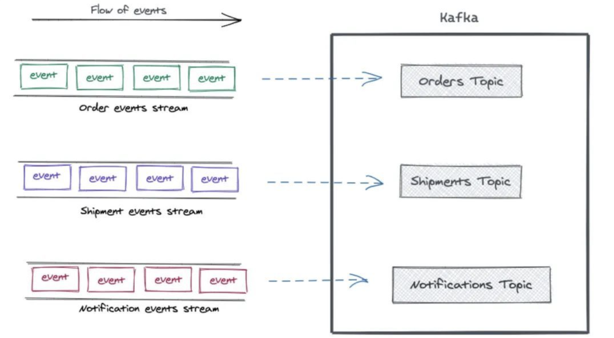
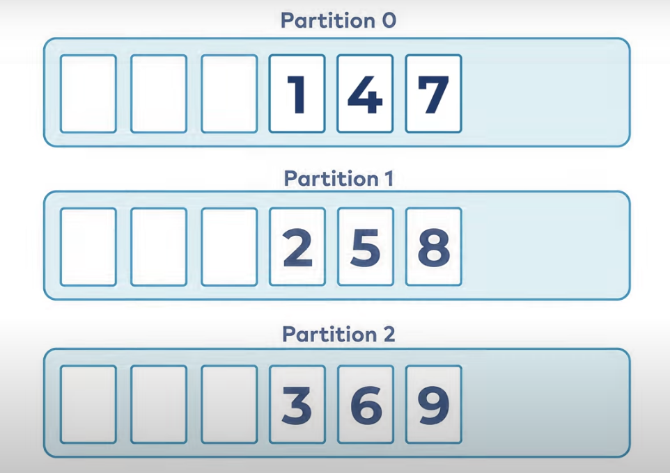
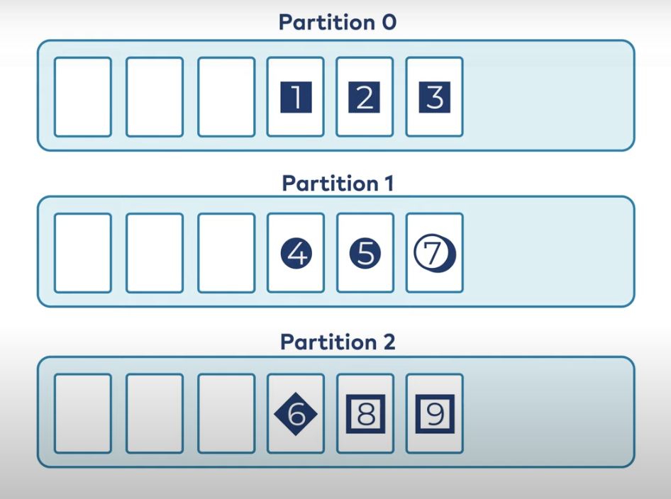
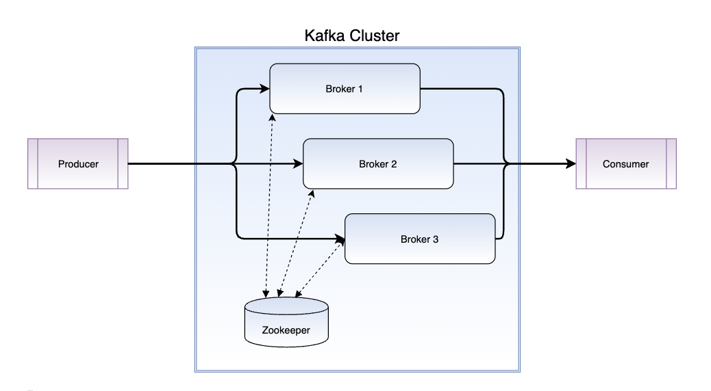
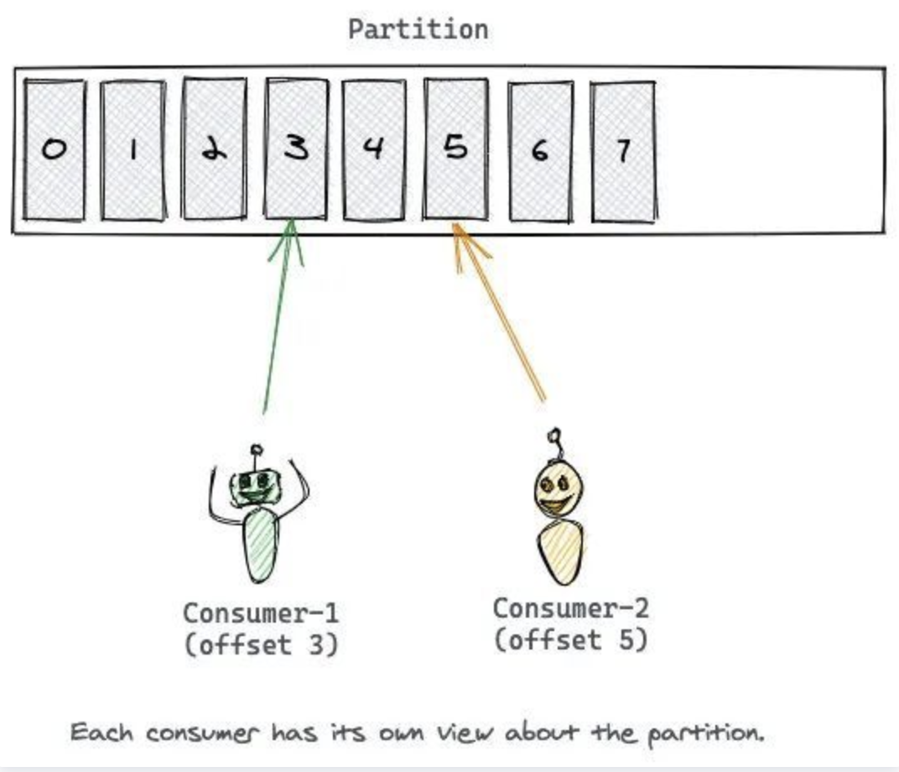
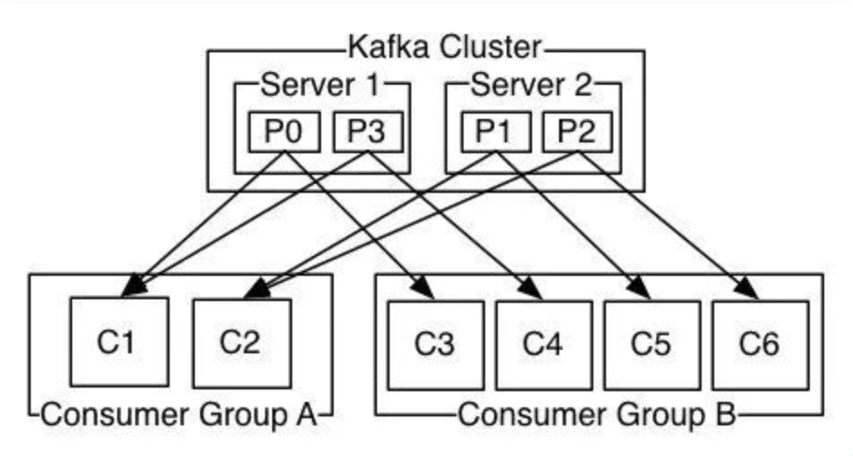
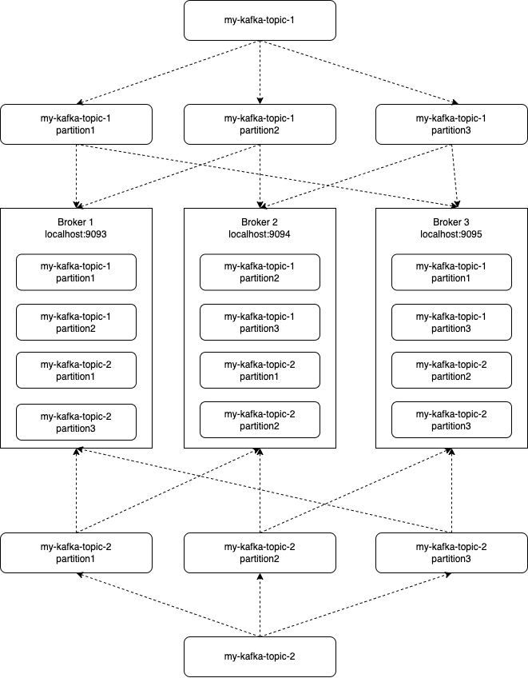

# Kafka Introduce

## Kafka

Apache Kafka is an event streaming platform used to collect, process, store, and integrate data at scale.

### Event

- Internet of things
- Business process change
- User interaction
- Microservice output

### Key/Value Pair

Kafka models events as key/value pairs.

The key part of a Kafka event is not necessarily a unique identifier for the event, like the primary key of a row in a relational database would be. It is more likely the identifier of some entity in the system.

Values are typically the serialized representation of an application domain object or some form of raw message input.

Kafka famously calls the translation between language types and internal bytes serialization and deserialization. The serialized format is usually JSON, Avro, or Protobuf.

## Topic

- Named container for similar events
  - Systems contain lots of topics
  - Can duplicate data between topics
- Durable logs of events
  - Append only
  - Can only seek by offset, not indexed
- Events are immutable

Apache Kafka's most fundamental unit of organization is the topic, which is something like a table in a relational database.

As a developer using Kafka, the topic is the abstraction you probably think the most about.

A topic is a log of events. Since Kafka topics are logs, there is nothing inherently temporary about the data in them. When you write an event to a topic, it is as durable as it would be if you had written it to any database you ever trusted.

## Partition

Partition takes the single topic log and breaks it into multiple logs, each of which can live on a separate node in the Kafka cluster.

### How Partitioning Works

- If a message has no key
  - Subsequent messages will be distributed round-robin among all the topic’s partitions.
  - 
- If the message does have a key
  - The destination partition will be computed from a hash of the key. 
  - This allows Kafka to guarantee that messages having the same key always land in the same partition, and therefore are always in order.
  - 

## Broker

From a physical infrastructure standpoint, Apache Kafka cluster is composed of a network of machines called brokers.

- An computer, instance, or container running the Kafka process
- Manage partitions
- Handle write and read requests
- Manage replication or partitions
- Intentionally very simple

Each broker hosts some set of partitions and handles incoming requests to write new events to those partitions or read events from them. Brokers also handle replication of partitions between each other.

## Replication

It would not do if we stored each partition on only one broker, so we need to copy partition data to several other brokers to keep it safe.

If one node(broker) in the cluster dies, another will take over its role.

- Copies of data for fault tolerance
- One lead partition and N-1 followers
- In general, writes and reads happen to the leader
- An invisible process to most developers
- Tunable in the Producer

## Producer

A Kafka producer client communicates with the Kafka brokers via the network for writing events. Once received, the brokers will store the events in a durable and fault-tolerant manner for as long as you need—even forever.

- Client application
- Put messages into topics
- Connection pooling
- Network buffering
- Partitions(It is the producer that makes the decision about which partition to send each message)

## Consumer

Events are durably stored in Kafka, they can be read as many times and by as many consumers as you want.

- Client application
- Reads messages from topics
- Connection pooling
- Network protocol
- Horizontally and elastically scalable
- Maintains ordering within partitions at scale

The Offset of the message is the Consumer's cursor, and the consumption of the message is recorded based on the Offset.

After reading a message, the Consumer advances to the next Offset in the Partition and continues reading the message.

Offset advancement and recording is the responsibility of the Consumer

A message will only be processed once by one consumer in a consumer group.

## Kafka Cluster, Topic, Partition, Broker, Replication

- my-kafka-topic-1 partition: 3 replication: 2
- my-kafka-topic-2 partition: 3 replication: 2

Shut down one of the three brokers that you ran(Such as Broker 1), and you should see that your cluster is still running fine.

Even though one of our brokers was shut down, our data was not lost. This is because the replication factor of 2 that we set earlier ensured that a copy of our data was present on multiple brokers.

## Ecosystem

- It helps to end up building common layers of application functionality to repeat certain undifferentiated tasks
- It does important work but is not tied in any way to the business you’re actually in
- it should be provided by the community or by an infrastructure vendor

### Schema Registry

- Schema Registry is a standalone server process that runs on a machine external to the Kafka brokers.
- Its job is to maintain a database of all of the schemas that have been written into topics in the cluster for which it is responsible
- Schema Registry is also an API that allows producers and consumers to predict whether the message they are about to produce or consume is compatible with previous versions

### Kafka Connect

### Kafka Streams

### ksqlDB

## References

- [Apache Kafka 101 video](https://developer.confluent.io/learn-kafka/apache-kafka/consumers/)
- [How to install and run a kafka cluster locally](https://www.sohamkamani.com/install-and-run-kafka-locally/)
