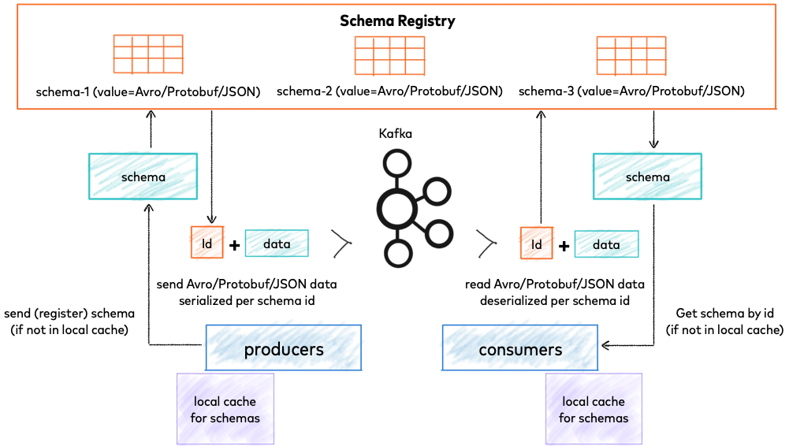

# Kafka Introduce

## Concept

Apache Kafka is an event streaming platform used to collect, process, store, and integrate data at scale.

### Event

An event is any type of action, incident, or change that's identified or recorded by software or applications. For example, a payment, a website click, business process change, microservice output, or a temperature reading, along with a description of what happened.

### Key/Value Pair

Kafka models events as key/value pairs.

The key part of a Kafka event is not necessarily a unique identifier for the event, like the primary key of a row in a relational database would be. It is more likely the identifier of some entity in the system.

Values are typically the serialized representation of an application domain object or some form of raw message input.

Kafka famously calls the translation between language types and internal bytes serialization and deserialization. The serialized format is usually JSON, Avro, or Protobuf.

### Topic

Apache Kafka's most fundamental unit of organization is the topic, which is something like a table in a relational database.

As a developer using Kafka, the topic is the abstraction you probably think the most about. It's like a named container for similar events.

A topic is a log of events. Since Kafka topics are logs, there is nothing inherently temporary about the data in them. When you write an event to a topic, it is as durable as it would be if you had written it to any database you ever trusted.

### Partition

Partition takes the single topic log and breaks it into multiple logs, each of which can live on a separate node in the Kafka cluster.

#### How Partitioning Works

First, messages are append only: When you write a new message into a log, it always goes on the end.

- If a message has no key
  - Subsequent messages will be distributed round-robin among all the topic’s partitions.
  - 
- If the message does have a key
  - The destination partition will be computed from a hash of the key. 
  - This allows Kafka to guarantee that messages having the same key always land in the same partition, and therefore are always in order.
  - 

### Broker

From a physical infrastructure standpoint, Apache Kafka cluster is composed of a network of machines called brokers.

A broker can be a computer, instance, or container running the Kafka process

Each broker hosts some set of partitions and handles incoming requests to write new events to those partitions or read events from them. Brokers also handle replication of partitions between each other.

### Replication

It would not do if we stored each partition on only one broker, so we need to copy partition data to several other brokers to keep it safe.

Copies of data for fault tolerance. If one node(broker) in the cluster dies, another will take over its role.

If the replication is N, it means one leader partition and N-1 followers. 

In general, reading and writing are done to the leader. The leader and the followers work together to replicate those to the followers.

### Producer

A Kafka producer is a client application that communicates with the Kafka brokers via the network for writing events. Once received, the brokers will store the events in a durable and fault-tolerant manner for as long as you need—even forever.

The producer puts messages into topics.

It is the producer that makes the decision about which partition to send each message.

### Consumer

Events are durably stored in Kafka, they can be read as many times and by as many consumers as you want.

A Kafka consumer also is a client application.

The consumer reads messages from topics.

The Offset of the message is the Consumer's cursor, and the consumption of the message is recorded based on the Offset.

After reading a message, the Consumer advances to the next Offset in the Partition and continues reading the message.

Consumers can commit their offsets in Kafka. The Kafka can store consumer offsets. So if a consumer shut down, and then restart again, it still knows the current position of a consumer.

A message will only be processed once by one consumer in a consumer group.

## Kafka Cluster, Topic, Partition, Broker, Replication

- my-kafka-topic-1 partition: 3 replication: 2
- my-kafka-topic-2 partition: 3 replication: 2

Shut down one of the three brokers that you ran(Such as Broker 1), and you should see that your cluster is still running fine.

Even though one of our brokers was shut down, our data was not lost. This is because the replication factor of 2 that we set earlier ensured that a copy of our data was present on multiple brokers.

## Ecosystem

It helps to end up building common layers of application functionality to repeat certain undifferentiated tasks.

It does important work but is not tied in any way to the business you’re actually in.

It should be provided by the community or by an infrastructure vendor.

### Schema Registry

Schema Registry is a standalone server process that runs on a machine external to the Kafka brokers.

Its job is to maintain a database of all the schemas that have been written into topics in the cluster for which it is responsible

Schema Registry is also an API that allows producers and consumers to predict whether the message they are about to produce or consume is compatible with previous versions

### Kafka Connect

In the world of information storage and retrieval, some systems are not Apache Kafka. Sometimes you would like the data in those other systems to get into Kafka topics, and sometimes you would like data in Kafka topics to get into those systems. As Apache Kafka's integration API, this is exactly what Kafka Connect does.

A Connect worker runs one or more connectors. A source connector reads data from an external system and produces it to a Kafka topic. A sink connector subscribes to one or more Kafka topics and writes the messages it reads to an external system.

### Kafka Streams

Kafka Streams is a Java API that gives you easy access to all the computational primitives of stream processing: filtering, grouping, aggregating, joining, and more, keeping you from having to write framework code on top of the consumer API to do all those things.

Kafka Streams can be integrated within your services as a library.

You can run it in the context of your application and don't require special infrastructure.

### ksqlDB

ksqlDB is a highly specialized kind of database that is optimized for stream processing applications. It runs on a scalable, fault-tolerant cluster of its own, exposing a REST interface to applications, which can then submit new stream processing jobs to run and query the results.

## References

- [Apache Kafka quick start in laptop](https://kafka.apache.org/quickstart)
- [Apache Kafka 101 video](https://developer.confluent.io/learn-kafka/apache-kafka/consumers/)
- [How to install and run a kafka cluster locally](https://www.sohamkamani.com/install-and-run-kafka-locally/)
